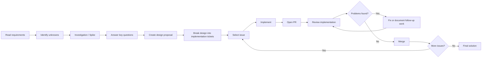
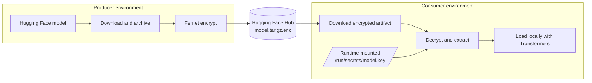

## Development approach and timeline

This exercise touches areas that are outside my primary area of expertise as an
AI Engineer, particularly around software supply-chain security and secure model
distribution.

For that reason, rather than jumping directly into implementation, I approached
the exercise as I would an unfamiliar engineering problem in a real project:
first understand the problem, reduce uncertainty through investigation, document
the design decisions, break the solution into small deliverables, and then
iterate through implementation and review.

The following timeline captures that process.

### 1. Initial setup

I started by adding the original exercise specification to the [`docs/`](docs/)
directory.

Keeping the original requirements alongside the implementation gave me a stable
reference while analysing the problem and making design decisions.

### 2. Investigate the problem before implementing

After reading the exercise, I created a spike to investigate possible
approaches:

- [Spike #1 — Analyse possible solutions](https://github.com/ANadalCardenas/confidential-model-distribution/issues/1)

Since the problem sits partly outside my usual domain, I used the spike to
explicitly write down the questions I needed to answer before committing to an
architecture.

I then investigated those questions and documented the conclusions directly in
the issue.

The goal at this stage was not to write code, but to reduce uncertainty and
identify a solution that I could reason about, implement and explain.

### 3. Turn the investigation into a design

The outcome of the spike became a concrete design proposal:

- [PR #2 — Design proposal](https://github.com/ANadalCardenas/confidential-model-distribution/pull/2)

This created a clear separation between **understanding the problem** and
**implementing the solution**, and provided a documented architecture against
which the implementation could later be reviewed.

### 4. Break the design into implementation tasks

Once the design was defined, I split the implementation into smaller,
independently trackable tickets:

- [Issue #3](https://github.com/ANadalCardenas/confidential-model-distribution/issues/3)
- [Issue #4](https://github.com/ANadalCardenas/confidential-model-distribution/issues/4)
- [Issue #5](https://github.com/ANadalCardenas/confidential-model-distribution/issues/5)
- [Issue #6](https://github.com/ANadalCardenas/confidential-model-distribution/issues/6)

This gave me a simple development plan and allowed each part of the solution to
be implemented and reviewed separately.

### 5. Implement, review and iterate

I started the implementation with [Issue #3](https://github.com/ANadalCardenas/confidential-model-distribution/issues/3),
using agentic coding tools to accelerate development.

The resulting implementation was submitted in:

- [PR #7 — Implement producer](https://github.com/ANadalCardenas/confidential-model-distribution/pull/7)

An important part of my workflow when using coding agents is that generated code
is treated as a proposal rather than automatically accepted output.

While reviewing the implementation, I identified some missing pieces. Under
normal circumstances I would usually address these within the same PR, but given
the time constraints of the exercise, I chose to explicitly document them so
that they were not silently lost:

- [Review finding #1](https://github.com/ANadalCardenas/confidential-model-distribution/pull/7#issuecomment-5645600476)
- [Review finding #2](https://github.com/ANadalCardenas/confidential-model-distribution/pull/7#issuecomment-5645605816)

The corresponding follow-up work was then captured as tickets for subsequent
development.

This review step is particularly important when working with agentic coding
tools: the agent accelerates implementation, but responsibility for
architecture, correctness and identifying missing behaviour remains with the
engineer.

### 6. Continue the implementation loop

After reviewing and merging PR #7, I moved to [Issue #4](https://github.com/ANadalCardenas/confidential-model-distribution/issues/4).

For Issue #4 and the subsequent implementation tickets, I followed the same
process:

1. Select the next issue.
2. Use agentic coding tools to support the implementation.
3. Open a pull request.
4. Review the proposed changes carefully.
5. Fix issues immediately where practical, or document them explicitly as
   follow-up work.
6. Merge once the implementation is in an acceptable state.
7. Move to the next issue.

The same process is applied to Issues
[#4](https://github.com/ANadalCardenas/confidential-model-distribution/issues/4),
[#5](https://github.com/ANadalCardenas/confidential-model-distribution/issues/5)
and [#6](https://github.com/ANadalCardenas/confidential-model-distribution/issues/6),
with each implementation developed through its own pull request.

### Overall workflow

More broadly, the complete approach used throughout the exercise was:



---

# Confidential Model Distribution

This proof of concept demonstrates confidential distribution of a Hugging Face
model between separate producer and consumer environments. The producer
downloads a small model, archives it, encrypts the archive with Fernet, and
uploads only the encrypted `model.tar.gz.enc` artifact. The consumer downloads
that artifact, reads the same decryption key from a file mounted at runtime,
decrypts and extracts the model, then loads it locally with Transformers.

This implementation intentionally uses Docker rather than Kubernetes. Docker
provides a small, reproducible demonstration of the same important boundary:
the consumer receives its secret at runtime and the key is neither committed to
Git, included in the image, nor uploaded to Hugging Face.

## Architecture



Only `model.tar.gz.enc` is published. The symmetric key is provisioned to the
consumer through a trusted, out-of-band mechanism; that transfer is outside the
scope of this PoC.

## Prerequisites

- Docker with permission to build and run images.
- A Hugging Face account and a target model repository. Create it before
  running the producer.
- A Hugging Face write token for the producer. The consumer needs a token only
  when downloading from a private repository.
- Python 3 and `cryptography` on the host to generate the Fernet key. The
  container images install their own Python dependencies.

Copy the example environment file and set the producer values:

```bash
cp .env.example .env
```

Set these values in `.env` (do not commit it):

```dotenv
HF_TOKEN=hf_your_write_token
HF_REPO_ID=your-account/your-encrypted-model-repo
SOURCE_MODEL_ID=hf-internal-testing/tiny-random-bert
```

## Generate the encryption key

Generate one Fernet key and store it in a protected local directory:

```bash
mkdir -p secrets
./scripts/generate-key.sh secrets/model.key
chmod 600 secrets/model.key
```

The key file is ignored by Git. Do not add it to the repository, an image, or a
Hugging Face repository.

## Run the producer

Build the producer image:

```bash
docker build -f producer/Dockerfile -t confidential-model-producer:local .
```

Run it with the key mounted read-only. `--env-file` supplies the repository,
token, and optional source-model settings from `.env`.

```bash
docker run --rm \
  --env-file .env \
  --mount type=bind,src="$(pwd)/secrets/model.key",dst=/run/secrets/model.key,readonly \
  confidential-model-producer:local
```

The producer downloads `SOURCE_MODEL_ID`, creates `model.tar.gz`, encrypts it,
and uploads only `model.tar.gz.enc` to `HF_REPO_ID`. Its final output contains
the uploaded artifact URL.

## Provision the consumer key

Transfer the same key to the consumer through a trusted channel outside this
PoC, for example an organisation's secret-management or secure file-transfer
process. On the consumer host, place it at a protected path such as
`secrets/model.key` and restrict permissions:

```bash
chmod 600 secrets/model.key
```

The consumer key must be the exact Fernet key used by the producer. It is
mounted at runtime rather than passed as an environment variable or baked into
the image.

## Run the consumer

Build the consumer image:

```bash
docker build -f consumer/Dockerfile -t confidential-model-consumer:local .
```

For a public repository run:

```bash
docker run --rm \
  --mount type=bind,src="$(pwd)/secrets/model.key",dst=/run/secrets/model.key,readonly \
  -e HF_REPO_ID="your-account/your-encrypted-model-repo" \
  confidential-model-consumer:local
```

For example:

```bash
docker run --rm \
    --mount type=bind,src="$(pwd)/secrets/model.key",dst=/run/secrets/model.key,readonly \
    -e HF_REPO_ID="AinaNadal/confidential-model-distribution" \
    confidential-model-consumer:local
```

The consumer downloads `model.tar.gz.enc`, reads `/run/secrets/model.key`,
authenticates and decrypts the artifact, extracts it under its temporary work
directory, and loads it with `AutoModel` using `local_files_only=True`. A
successful run prints `Successfully loaded decrypted model: ...`.

## Security assumptions and limitations

- Fernet provides authenticated encryption: a wrong key or modified ciphertext
  fails decryption. It does not protect the plaintext model after it is
  decrypted on the consumer host.
- The producer and consumer are logically separate environments. Docker is
  solely a local demonstration and is not a secure key-transfer solution.
- Secure, authenticated, out-of-band delivery and rotation/revocation of the
  Fernet key are external operational responsibilities.
- A read-only bind mount limits accidental modification by the container, but a
  host or workload attacker able to read the mounted secret can still obtain
  it. Use an appropriate production secret manager and workload isolation.
- Hugging Face repository access is independent of encryption. Use a private
  repository and least-privilege tokens where appropriate; encryption remains
  the primary protection for the published artifact in this PoC.
- This is deliberately a small demonstration, not a production key-management,
  model-attestation, malware-scanning, audit, or Kubernetes deployment system.

## Run the tests

The unit tests are offline and do not contact Hugging Face:

```bash
python3 -m pytest -q
```
