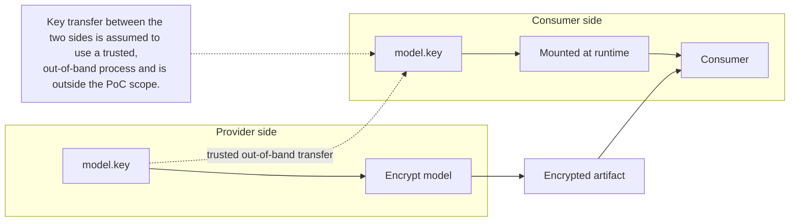
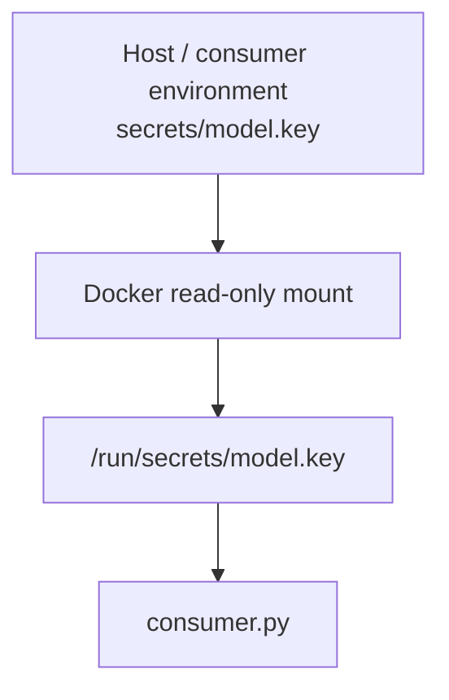
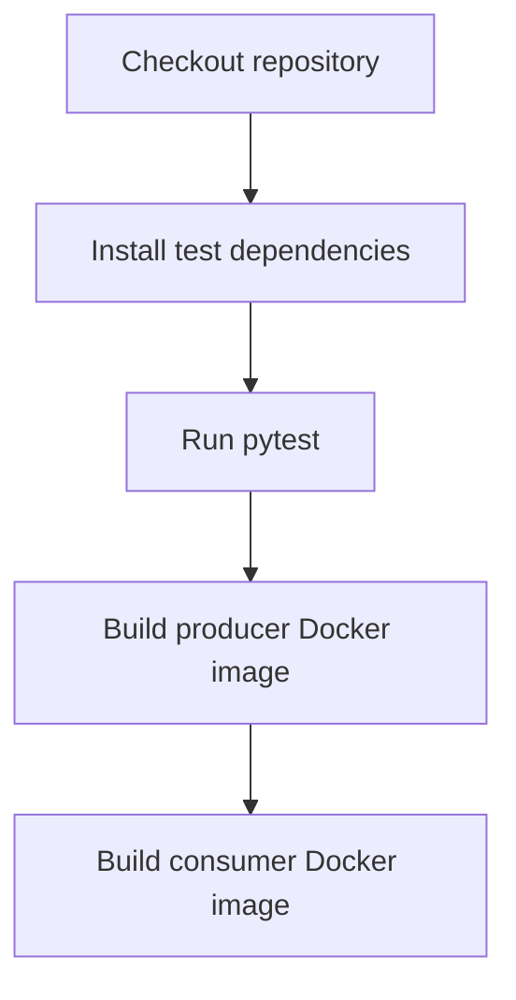

# Docker-Based Confidential Model Distribution


This guide describes a deliberately simple Docker implementation of the mandatory exercise flow. It keeps the producer and consumer separate, encrypts the model before publication, and injects the decryption key into the consumer at runtime. It does not attempt to reproduce the Kubernetes requirement.

## 1. Repository structure

```text
confidential-model-distribution/
│
├── producer/
│   ├── Dockerfile
│   ├── producer.py
│   └── requirements.txt
│
├── consumer/
│   ├── Dockerfile
│   ├── consumer.py
│   └── requirements.txt
│
├── common/
│   └── crypto.py
│
├── scripts/
│   └── generate-key.sh
│
├── tests/
│   └── test_crypto.py
│
├── .github/
│   └── workflows/
│       └── test.yml
│
├── compose.yaml
├── .env.example
├── .gitignore
└── README.md
```

## 2. High-level architecture


The producer and consumer should be treated as logically separate environments, potentially belonging to different companies. Docker Compose is only a convenient way to demonstrate both sides locally.

## 3. Main design assumption

Assume that the symmetric encryption key is provisioned to the consumer through a trusted out-of-band process. The project does not need to implement that transfer mechanism. The important point is that the key is not stored in Hugging Face, committed to Git, or built into either Docker image.



## 4. Suggested libraries and tools

| Purpose | Suggestion | Why |
|---|---|---|
| Encryption | `cryptography` / Fernet | Very small API, authenticated encryption, easy to explain and difficult to misuse. |
| Model download/upload | `huggingface_hub` | Simple API for downloading models and publishing artifacts. |
| Model loading | `transformers` | Straightforward way to prove the decrypted model can be loaded. |
| Runtime | Docker + Docker Compose | Matches the implementation approach and keeps the demo reproducible. |
| Testing | `pytest` | Enough for a small crypto round-trip test and failure case. |
| CI | GitHub Actions | Build both images and run tests automatically. |

## 5. File responsibilities

| File | Responsibility |
|---|---|
| `producer/producer.py` | Download a small Hugging Face model, package it, encrypt it, and upload the encrypted artifact. |
| `producer/Dockerfile` | Containerise the producer. |
| `consumer/consumer.py` | Download the encrypted artifact, read the runtime key, decrypt the model, and load it. |
| `consumer/Dockerfile` | Containerise the consumer. |
| `common/crypto.py` | Provide small reusable encrypt/decrypt helpers. |
| `scripts/generate-key.sh` | Generate the symmetric encryption key locally. |
| `tests/test_crypto.py` | Verify encrypt/decrypt round-trip and failure with an invalid key. |
| `.github/workflows/test.yml` | Run tests and build the two Docker images. |
| `compose.yaml` | Local demonstration only; producer and consumer remain logically independent. |
| `.env.example` | Document the expected Hugging Face configuration variables. |
| `.gitignore` | Exclude keys, tokens, local `.env` files, temporary model files, and caches. |
| `README.md` | Explain architecture, commands, assumptions, limitations, and the Kubernetes deviation. |

## 6. Encryption

Use Fernet from Python's `cryptography` package. For this PoC there is no need to design a custom cryptographic format or manually implement AES.

- Generate one Fernet key with `scripts/generate-key.sh`.
- Use the same key to encrypt on the producer side and decrypt on the consumer side.
- Keep the key outside Git and outside the Docker images.
- Mount the key into the consumer container at runtime as a read-only file.
- Document that secure transfer of the key to the consumer is an external trust assumption.

## 7. Model

Use a deliberately small Hugging Face model. The goal is to demonstrate secure distribution, not model quality.

- Download the model directory with `huggingface_hub`.
- Archive the directory as `model.tar.gz`.
- Encrypt the archive to produce `model.tar.gz.enc`.
- Upload only `model.tar.gz.enc` to the chosen Hugging Face repository.
- The consumer downloads, decrypts, extracts and loads the model locally.

## 8. Runtime secret handling

Do not pass the decryption key as a hard-coded Docker environment variable and do not copy it into either image. Prefer a file mounted at runtime.



This is the Docker equivalent of the secret-injection concept used by the Kubernetes version: the workload receives the secret at runtime rather than carrying it inside the image.

## 9. Docker Compose

Keep one `compose.yaml` only for local evaluation. It can define a producer service and a consumer service, but the README should state that they are not expected to run on the same machine in a real deployment.

```bash
# Local demonstration only
docker compose run --rm producer
docker compose run --rm consumer
```

## 10. Tests

Keep the test suite minimal. Two tests are enough:

- Encrypt a small byte/file payload and verify that decrypting it returns the original content.
- Attempt decryption with a different key and verify that it fails.

Do not make unit tests depend on Hugging Face or network access. The end-to-end Hugging Face flow can be tested manually with `scripts/verify.sh`.

## 11. GitHub Actions

A simple CI pipeline is enough:



Avoid publishing models to Hugging Face on every CI run. That would add credentials, external state and unnecessary complexity.

## 12. Environment variables

Keep `.env` small. Typical values are:

```dotenv
HF_TOKEN=
HF_REPO_ID=
SOURCE_MODEL_ID=
```

The producer needs a Hugging Face token with write access. The consumer only needs a token if the repository is private. For simplicity, using a private repository is reasonable, although encryption itself is the main protection mechanism.

## 13. README structure

A concise README can follow this structure:

- Overview
- Architecture
- Scope deviation from the Kubernetes assignment
- Prerequisites
- Generate the encryption key
- Run the producer
- Provision the key to the consumer
- Run the consumer
- Security assumptions and limitations

The README should explicitly say that the solution preserves the producer/consumer and runtime secret-injection concepts but intentionally replaces Kubernetes with Docker.

## 14. Suggested implementation order

1. Implement `producer` and verify that an encrypted model artifact is uploaded to Hugging Face. Include dockerfile, tests and the first github testing workflow.
2. Implement `consumer` and verify that it can download, decrypt and load the model.
3. Add `compose.yaml` for local demonstration.
4. Finish the README.
